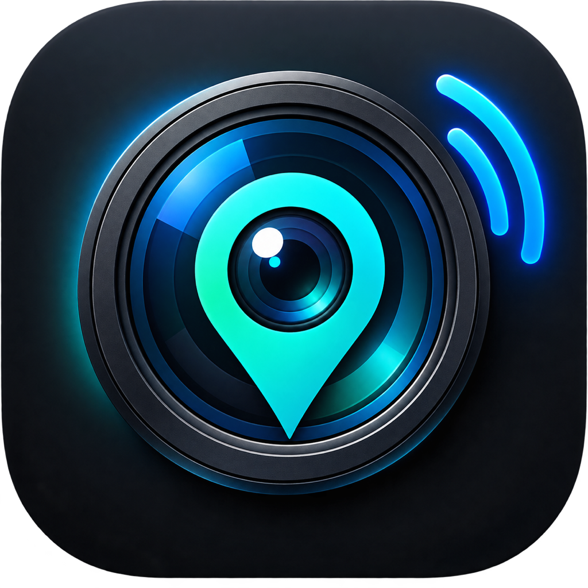

# LumiGeo

  

  <strong>Panasonic LUMIX カメラ GPS ジオタグ自動同期 iOS アプリケーション</strong> 
  <em>Automatic Background GPS Geotagging & BLE Sync for Panasonic LUMIX Cameras</em>

  <a href="https://ryu2012.github.io/lumigeo-support/privacy.html">Privacy Policy</a> •
  <a href="https://github.com/ryu2012/lumigeo-support/issues">Issues / Feedback</a>

---

## 🇯🇵 日本語 (Japanese)

### 概要
**LumiGeo（ルミジオ）** は、Panasonic LUMIX カメラをお使いのフォトグラファーのための、常時 Bluetooth Low Energy (BLE) バックグラウンド接続・高精度 GPS 位置情報自動同期 iOS アプリケーションです。

iPhone をポケットやバッグに入れたまま、カメラの電源を入れるだけで自動的に再接続し、撮影写真へリアルタイムに正確な位置情報を記録します。

### 主な特徴
- **自動再接続 & バックグラウンド同期**:
  iOS のバックグラウンド復帰機能を活用。iPhone がスリープ状態でも、カメラの電源 ON を検知して自動で接続・位置情報送信を開始します。
- **高精度リアルタイム GPS**:
  撮影位置のズレを防ぐため、移動速度や測位精度に応じた最適な更新頻度でカメラへジオタグを送信します。
- **高いプライバシー保護**:
  位置情報やカメラ識別情報は、iPhone とカメラの間だけで完結します。外部サーバーへの送信や収集は一切行いません。

### 動作確認済み機種
- **LUMIX Sync 方式**: Panasonic LUMIX S1（ペアリング時 Wi-Fi 認証 ➡ BLE 同期）
- **LUMIX Lab 方式**: Panasonic LUMIX S9 / LUMIX L10（BLE 直接同期）

---

## 🇺🇸 English

### Overview
**LumiGeo** is an iOS utility app tailored for photographers using Panasonic LUMIX cameras, offering seamless Bluetooth Low Energy (BLE) background reconnection and precise real-time GPS location synchronization.

Keep your iPhone in your pocket or camera bag; simply turn on your camera, and LumiGeo automatically connects and writes accurate geotags to your photos.

### Key Features
- **Automatic Background Reconnection**:
  Utilizes iOS CoreBluetooth background preservation and restoration. LumiGeo automatically wakes up and resumes GPS sync whenever your camera powers on.
- **Accurate Real-Time Geotagging**:
  Continuously supplies high-precision coordinates with optimal transmission intervals, ensuring every shot captures the exact location.
- **Privacy-First Design**:
  All GPS data and device information stay strictly local between your iPhone and camera. No data is collected, stored remotely, or sent to third-party servers.

### Verified Camera Models
- **LUMIX Sync Protocol**: Panasonic LUMIX S1 (Wi-Fi pairing auth ➡ BLE sync)
- **LUMIX Lab Protocol**: Panasonic LUMIX S9 / LUMIX L10 (Direct BLE sync)

---

## リンク / Links
- **プライバシーポリシー (Privacy Policy)**: [https://ryu2012.github.io/lumigeo-support/privacy.html](https://ryu2012.github.io/lumigeo-support/privacy.html)
- **不具合報告・ご要望・お問い合わせ (Issues & Contact)**: [GitHub Issues](https://github.com/ryu2012/lumigeo-support/issues)

---

### 免責事項 / Disclaimer
*LUMIX および Panasonic は、パナソニックホールディングス株式会社の登録商標または商標です。LumiGeo は独立したサードパーティツールであり、パナソニックと提携、承認、支援されているものではありません。*  
*Panasonic and LUMIX are registered trademarks of Panasonic Holdings Corporation. LumiGeo is an independent third-party tool and is not affiliated with, endorsed, or sponsored by Panasonic.*
